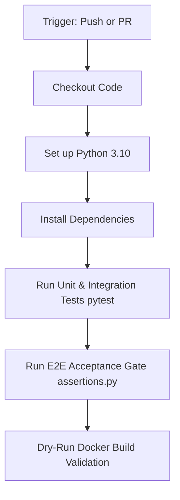

# 🚀 CI/CD Documentation - Retail Intelligence Platform

This document describes the design, execution steps, validation constraints, and security practices of the Continuous Integration (CI) pipeline implemented for the **Retail Intelligence Platform**.

---

## 🏛️ CI/CD Philosophy & Rules

The Retail Intelligence Platform is deployed across active production workloads. Therefore, the CI pipeline is designed with a **strict validation-only philosophy**:

* **Non-invasive Execution:** The pipeline runs tests, validates dependency integrity, and performs Docker build checks. It **never** executes automated code deployments, database migrations, or infrastructure provisioning.
* **No Side-effects:** Ingestion telemetry, mock pipelines, and DB engines run in clean, isolated, ephemeral test contexts.
* **Frictionless Feedback:** Provides immediate feedback to developers on pull requests without requiring live cloud databases (Neon) or expensive GPU instances.

---

## 🛠️ GitHub Actions CI Workflow Structure

The CI pipeline is defined in [`.github/workflows/ci.yml`](file:///c:/Deepyaman%20Mondal/retail-intelligence-platform/.github/workflows/ci.yml) and is triggered automatically on:
1. Every `push` to the `main` branch.
2. Every `pull_request` targeting the `main` branch.

### Pipeline Stages

The workflow consists of a single `validate` job running on a high-performance virtual environment (`ubuntu-latest`):



### Stage Breakdown

#### 1. Setup Python Environment
* Utilizes `actions/setup-python@v4` configured for Python `3.10` to balance stability and dependency compatibility.
* Caches pip packages dynamically to speed up consecutive run times.

#### 2. Install Project Dependencies
* Installs dependencies defined in the production [`requirements.txt`](file:///c:/Deepyaman%20Mondal/retail-intelligence-platform/requirements.txt), along with the `httpx` testing dependency required by FastAPI's `TestClient` for E2E assertions:
  ```bash
  pip install --upgrade pip
  pip install -r requirements.txt
  pip install httpx
  ```

#### 3. Run Unit and Integration Tests
* Runs the core test suite to verify centroid association trackers, spatial Ray-Casting formulas, and analytical metric engines:
  ```bash
  pytest -v
  ```
* Leverages existing mocks to avoid requiring a running database server.

#### 4. Run E2E Acceptance assertions.py Gate
* Spawns validation checks via the existing E2E client script:
  ```bash
  python assertions.py
  ```
* Because no live FastAPI server is running inside the GitHub runner, `assertions.py` automatically falls back to standard FastAPI `TestClient` verification, executing all 10 core endpoint assertions in-memory.

#### 5. Dry-Run Docker Build Validation
* Validates that the multi-stage [`Dockerfile`](file:///c:/Deepyaman%20Mondal/retail-intelligence-platform/Dockerfile) compiles correctly.
* Runs a dry-run build using the default Docker build actions without pushing images to container registries:
  ```bash
  docker build -t retail-intel-api-test:latest .
  ```

---

## 💻 Local Validation Checklist

Before pushing code or opening a pull request, developers should execute the identical validation steps locally:

1. **Verify Unit Tests:**
   ```bash
   pytest
   ```
2. **Verify Acceptance Gate:**
   ```bash
   python assertions.py
   ```
3. **Verify Local Docker Container Compilation:**
   ```bash
   docker build -t local-test-build .
   ```
