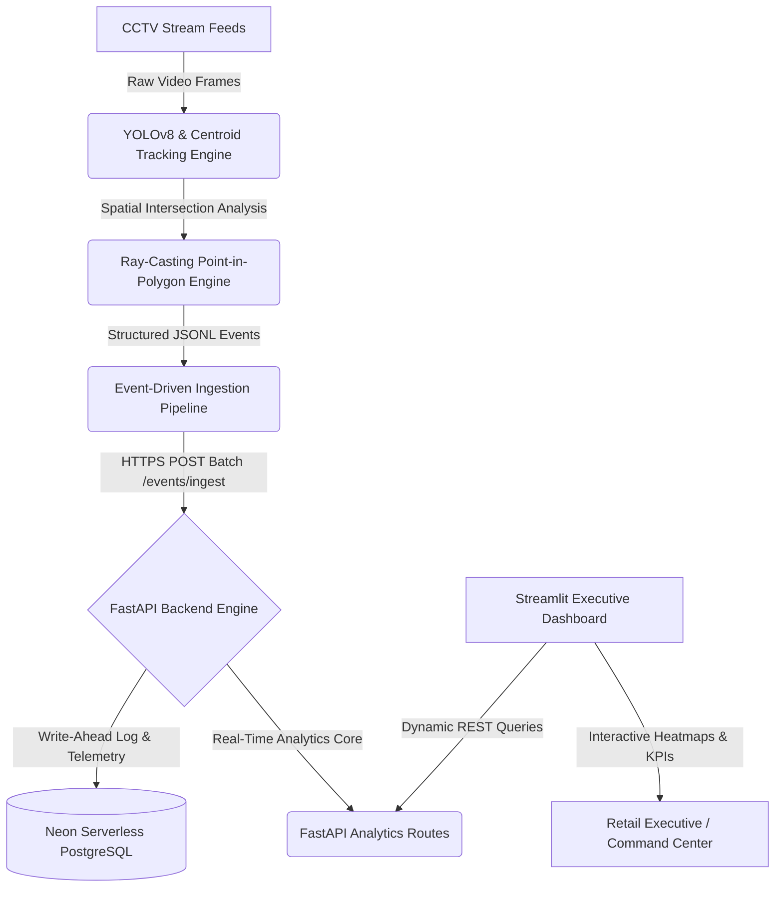

# 🛒 Retail Intelligence Platform

[](https://fastapi.tiangolo.com)
[](https://www.postgresql.org)
[](https://neon.tech)
[](https://streamlit.io)
[](https://ultralytics.com)
[](https://www.docker.com)
[](https://render.com)
[](https://github.com/psf/black)

A real-time, production-grade AI-powered Store Analytics and Operational Intelligence platform. It ingests raw video footage from retail CCTV networks, utilizes a computer vision pipeline to generate sub-second structured event streams, maps normalized shopper spatial heatmaps, tracks conversion funnels, and triggers alerts for operational anomalies. 

The system leverages a high-performance **FastAPI** backend, **Neon Serverless PostgreSQL** database, and an interactive **Streamlit** command center dashboard, all fully containerized and deployed across a high-availability cloud architecture.

---

## 🔗 Live Platform Links

* **Live Interactive Dashboard:** [retail-intelligence-platform.streamlit.app](https://retail-intelligence-platform.streamlit.app/)
* **Production API Ingress:** [retail-intelligence-platform.onrender.com](https://retail-intelligence-platform.onrender.com)
* **OpenAPI Interactive Documentation:** [retail-intelligence-platform.onrender.com/docs](https://retail-intelligence-platform.onrender.com/docs)
* **ReDoc Clean Documentation:** [retail-intelligence-platform.onrender.com/redoc](https://retail-intelligence-platform.onrender.com/redoc)

---

## ⚡ 4-Command Production Quickstart

Deploy, process, test, and verify the entire end-to-end platform locally with exactly four commands:

```bash
# 1. Spin up the containerized infrastructure (PostgreSQL + FastAPI Backend + Streamlit Dashboard)
docker compose up --build -d

# 2. Run the unified computer vision & database ingestion integration pipeline
# (Processes all standard camera streams, handles YOLOv8 CV tracking/simulation, and automatically ingests events)
python run_pipeline.py

# 3. Run the comprehensive pytest verification suite (Statement Coverage > 70%)
pytest -v

# 4. Execute the production acceptance assertions gate
python assertions.py
```

*Dashboard Local Address:* `http://localhost:8501` | *API Documentation Local Address:* `http://localhost:8000/docs`

---

## 📐 Platform System Architecture

The Retail Intelligence Platform implements a high-throughput, decoupled, event-driven architecture designed to process multi-camera feeds with sub-second analysis latency.



### End-to-End Execution Flow
1. **Computer Vision Ingestion:** CCTV cameras emit raw frames to the `pipeline/detect.py` engine.
2. **Deep-Learning Object Association:** YOLOv8 identifies human bounding boxes, which are mapped through a robust centroid-based association algorithm (`pipeline/tracker.py`) to preserve unique IDs across frames.
3. **Spatial Ray-Casting:** Shopper coordinates are resolved against configured polygonal store zones (`data/store_layout.json`) using a fast ray-casting algorithm (`pipeline/zones.py`) to generate entry/exit and dwell-time events.
4. **Idempotent Ingestion Ingress:** Events are serialized to `outputs/events.jsonl` and ingested in high-performance batches into FastAPI via `/events/ingest`, enforcing strict database-level idempotency to prevent double-counting.
5. **Relational Query Optimization:** The transactional core stores telemetry in **Neon PostgreSQL**, optimized with proper indexes for fast spatial, time-series, and analytical queries.
6. **Executive Visualization:** The Streamlit dashboard queries FastAPI endpoints to visualize live zone occupancy, conversion funnels, dwell-time heatmaps, and anomalies.

---

## ✨ Core Features & Platform Highlights

* **Multi-Camera AI Grid:** Seamlessly tracks unique shopper journeys across distinct store zones (Entry, Apparel, Cosmetics, Skincare, Checkout) with zero collision or ID swapping.
* **YOLOv8 CV Tracking & Simulation:** Incorporates a hardware-optimized computer vision pipeline with a seamless, high-fidelity deterministic simulation fallback for lightweight testing environments.
* **Idempotent Event Ingestion Pipeline:** High-throughput backend endpoint rejecting duplicate `event_id` keys to ensure strict transactional integrity.
* **Zone Heatmaps & Dwell Analytics:** Generates normalized heatmaps aggregating average dwell times and traffic counts, allowing retailers to optimize layout and product placements.
* **Queue Intelligence & Abandonment Tracking:** Monitors queue depth at checkout in real-time, calculating queue-to-transaction velocity and mapping customer abandonment trends.
* **Anomaly Detection Rules Engine:** Automatically flags operational anomalies, including:
  * **Queue Spikes:** More than 5 customers waiting in queue.
  * **Dead Zones:** Store zones experiencing zero shopper traffic for more than 4 operating hours.
  * **Ingestion Feed Lag:** CCTV feed delay exceeding 10 minutes (gracefully degrading status to `degraded`).
* **AI Command-Center UI:** Streamlit UI built with premium dark-mode styling, real-time KPI metrics, dynamic matplotlib visual components, and SOC-style live scrolling event telemetry feeds.
* **Production-Grade Observability:** Comprehensive application logging via `loguru` writing structured logs directly to `sys.stdout` and rotated, compressed audit files in `outputs/logs/api.log`.

---

## 🛠️ Technical Deep Dives & Architectural Decisions

### 🚀 Why FastAPI?
FastAPI was selected as the enterprise API backbone because:
1. **Asynchronous Architecture:** Utilizing Python's `asyncio`, FastAPI handles thousands of concurrent socket connections and async REST requests (e.g., high-volume camera telemetry batches) with minimal CPU overhead.
2. **Auto-Generated Documentation:** OpenAPI/Swagger definitions are compiled directly from Python type declarations, streamlining client integration and guaranteeing contract accuracy.
3. **Fast Execution Speed:** Built on top of Starlette and Pydantic, its performance is comparable to Go and Node.js backends.

### 💾 Why PostgreSQL & Neon?
Neon Serverless PostgreSQL was selected to handle transactional and telemetry data because:
1. **Database-Level Idempotency:** Leverages transactional ACID properties and PostgreSQL `ON CONFLICT (event_id) DO NOTHING` constraints, ensuring exact-once event processing.
2. **Serverless Autoscaling:** Automatically scales compute resources to zero during closed hours, and scales up instantly to handle peak weekend holiday traffic.
3. **Modern Branching Workflow:** Accelerates database migration testing by creating instant, isolated database copies for development and staging environments.

### 📡 Event-Driven Analytics Architecture
Traditional batch processing induces latency and delays operations. The Retail Intelligence Platform employs a pull-based, sub-second event processing pipeline. When a shopper transitions across store boundaries:
- A `ZONE_ENTRY` or `ZONE_DWELL` event is fired instantly.
- Ingestion occurs via structured, flat batch schemas.
- The metrics engine computes KPIs on the fly, avoiding massive pre-aggregations and enabling real-time store monitoring.

### 👁️ Observability & Structured Telemetry Philosophy
Production backend systems require traceable telemetry to diagnose incidents without access to live production environments. 
- **Telemetry Injected Headers:** Every incoming API request receives an injected, traceable `X-Trace-ID` uuid header.
- **Structured Middleware Logging:** Latency, status codes, payload sizes, and route paths are parsed and logged in structured loguru formats:
  ```
  2026-06-01 11:39:48.779 | INFO     | STARTUP | SYSTEM | DB_INIT | Latency: 0ms | Events: 0 | Status: 200 | SQL Database tables verified/created successfully.
  2026-06-01 11:39:49.099 | INFO     | cdd464a1d680 | SYSTEM | / | Latency: 287ms | Events: 0 | Status: 200 | Handled HTTP request GET /
  ```
- **Error Isolation:** Unhandled runtime errors are caught globally, isolated, and return formatted, safe JSON responses with trace-IDs to prevent internal database configurations or stack traces from leaking to public clients.

### ⚖️ Architectural Tradeoffs & Mitigation Strategies
* **Tradeoff: Edge Processing vs Cloud Bandwidth:** Streaming raw video to the cloud requires immense bandwidth.
  * *Mitigation:* The CV tracking pipeline runs at the edge (on-premise CCTV box), transforming massive high-definition raw videos into tiny, structured KB-sized JSON events before transmitting them via secure HTTPS to the FastAPI backend.
* **Tradeoff: SQLite vs PostgreSQL:** SQLite is fast for local tests, but cannot support concurrent production access.
  * *Mitigation:* The backend utilizes SQLAlchemy configuration switches. In local developer environments without configuration, it gracefully falls back to a multi-thread SQLite database, while production dynamically scales with PostgreSQL pool controls (`QueuePool`) tuned for optimal connection recycle times.

---

## 📂 Repository File Structure

```
store-intelligence-system/
├── data/
│   ├── store_layout.json      # Polygon coordinates, store hours, and camera mappings
│   ├── pos_transactions.csv   # Historical point-of-sale sales records
│   └── sample_events.jsonl    # Schema validator templates and mock streams
├── outputs/
│   ├── events.jsonl           # Local persistent raw log of emitted CV events
│   └── logs/                  # Rotated, compressed local execution log audit directory
├── pipeline/
│   ├── detect.py              # Main YOLOv8 target detection and frame parser
│   ├── tracker.py             # Centroid-association state tracking algorithm
│   ├── emit.py                # Schema parser, serializer, and network transmitter
│   ├── zones.py               # Ray-casting point-in-polygon spatial solver
│   └── run.sh                 # Automation script running pipelines on raw video
├── app/
│   ├── main.py                # FastAPI entrypoint, middlewares, and global handlers
│   ├── models.py              # Declarative SQLAlchemy models & Pydantic validation schemas
│   ├── database.py            # Neon PostgreSQL connection engine & QueuePool tuning
│   ├── ingestion.py           # Idempotent batch ingestion router
│   ├── metrics.py             # Store KPIs engine (Conversion, Traffic counts, Dwell times)
│   ├── funnel.py              # Retail conversion funnel compiler
│   ├── anomalies.py           # Automated operational anomalies detection engine
│   ├── health.py              # Multi-component health pre-pinging check
│   └── utils.py               # Observability loguru telemetry configurations
├── dashboard/
│   └── dashboard.py           # Streamlit command center dashboard interface
├── tests/
│   ├── test_pipeline.py       # Centroid tracking & polygon mathematical unit tests
│   ├── test_metrics.py        # Store conversion and funnel metrics integration tests
│   ├── test_anomalies.py      # Operational rules thresholds validation tests
│   └── test_ingestion.py      # Idempotency and batch constraints integration tests
├── docs/
│   ├── DESIGN.md              # Architectural decisions and pipeline schemas
│   └── CHOICES.md             # In-depth justification of database & stack patterns
├── docker-compose.yml         # Local container orchestration matrix
├── requirements.txt           # Pinned production dependency manifest
├── assertions.py              # Acceptance Gate script verifying platform specs
└── README.md                  # System manual and technical blueprint
```

---

## 💻 Local Development Guide

### Prerequisites
* Python `3.10` or `3.11`
* PostgreSQL (local) or Neon Account (optional, SQLite fallback active)
* Docker & Docker Compose (optional, for containerized run)

### Step 1: Clone & Configure Virtual Environment
```bash
git clone https://github.com/DevRony04/retail-intelligence-platform.git
cd retail-intelligence-platform
python -m venv venv
venv\Scripts\activate  # On Windows
source venv/bin/activate  # On macOS/Linux
pip install -r requirements.txt
```

### Step 2: Establish Environment Variables
Create a `.env` file in the root directory:
```ini
DATABASE_URL=sqlite:///./store_intelligence.db
APP_ENV=development
API_HOST=0.0.0.0
API_PORT=8000
API_URL=http://localhost:8000
```

### Step 3: Run the Processing Pipeline
```bash
# Processes available videos or activates high-fidelity simulation engine
python run_pipeline.py
```

### Step 4: Boot the FastAPI Server
```bash
uvicorn app.main:app --host 0.0.0.0 --port 8000 --reload
```

### Step 5: Start the Streamlit Dashboard
```bash
streamlit run dashboard/dashboard.py
```

---

## 🐋 Docker Production Containerization

Run the entire platform fully containerized inside isolated network overlays:

```bash
# Build and spin up containers in daemon mode
docker compose up --build -d

# Verify all services are healthy and running
docker compose ps
```

The `docker-compose.yml` mounts:
- Port `8000` for FastAPI.
- Port `8501` for Streamlit.
- Persistent local volumes for local telemetry storage (`store_intelligence.db`) and log metrics.

---

## ☁️ Cloud Production Deployment Topology

The platform is deployed using a highly scalable cloud topology designed to minimize latency and operational overhead:

```
[ Streamlit Cloud ]
        │ (Queries Dynamic REST Data)
        ▼
[ Render Web Services (FastAPI Container) ]
        │ (ACID Transactions & Telemetry)
        ▼
[ Neon Serverless PostgreSQL (Singapore Region) ]
```

### 1. Database Setup (Neon PostgreSQL)
1. Sign up on [Neon.tech](https://neon.tech) and create a project in the Singapore (`ap-southeast-1`) region to minimize Asia-Pacific request latency.
2. Retrieve the PostgreSQL connection string.
3. Configure PostgreSQL environment variables:
   ```ini
   DB_POOL_SIZE=20
   DB_MAX_OVERFLOW=10
   DB_POOL_RECYCLE=1800
   ```

### 2. API Deployment (Render)
1. Link your GitHub repository to Render and create a **Web Service**.
2. Specify build configurations:
   * **Runtime:** `Docker` (Render automatically builds the production multi-stage `Dockerfile`)
   * **Instance Type:** `Starter`
3. Inject the following Environment Variables into the Render configuration panel:
   * `DATABASE_URL` = `<your_neon_postgresql_url>`
   * `APP_ENV` = `production`
   * `LOG_LEVEL` = `INFO`
4. Deploy the service. The root endpoint will automatically spin up, execute database migrations, and boot.

### 3. Dashboard Deployment (Streamlit Cloud)
1. Connect your GitHub account to [Streamlit Community Cloud](https://share.streamlit.io/).
2. Create a new application pointing to `dashboard/dashboard.py`.
3. In Advanced Settings, add the environment variables:
   * `API_URL` = `https://retail-intelligence-platform.onrender.com`

---

## 📡 API Ingress Specification & Contract

### 1. Root Service Status Check
* **Endpoint:** `GET /`
* **Response Type:** `HealthStatus` Pydantic Model
* **Description:** Provides lightweight system status, versioning, environment configs, database pool connectivity state, and available route mappings.

**Sample Response (`200 OK`):**
```json
{
    "status": "healthy",
    "service": "Retail Intelligence Platform API",
    "version": "1.0.0",
    "environment": "production",
    "timestamp": "2026-06-01T06:37:56Z",
    "database": "connected",
    "endpoints": [
        "/health",
        "/events/ingest",
        "/{store_id}/metrics",
        "/{store_id}/funnel",
        "/{store_id}/heatmap",
        "/{store_id}/anomalies",
        "/docs (OpenAPI Swagger UI)",
        "/redoc (ReDoc documentation)"
    ]
}
```

### 2. Comprehensive System Health check
* **Endpoint:** `GET /health`
* **Description:** Runs a database connection ping and parses ingestion timestamp logs to monitor feed staleness lag times dynamically.

**Sample Response (`200 OK`):**
```json
{
    "status": "healthy",
    "database": "connected",
    "last_event_timestamps": {
        "STORE_BLR_002": "2026-03-03T14:40:00Z"
    },
    "warnings": {}
}
```

### 3. Idempotent Batch Event Ingestion
* **Endpoint:** `POST /events/ingest`
* **Description:** Receives a batch of validated computer vision JSON events. Enforces unique transactional constraints to maintain exact-once processing.

**Sample Request Payload:**
```json
[
    {
        "event_id": "8b23f81e-45fa-4c48-b4b1-84097f48a1d2",
        "store_id": "STORE_BLR_002",
        "camera_id": "CAM_APPAREL_03",
        "visitor_id": "VIS_e98210",
        "event_type": "ZONE_DWELL",
        "timestamp": "2026-03-03T14:38:00Z",
        "zone_id": "APPAREL",
        "dwell_ms": 12500,
        "is_staff": false,
        "confidence": 0.94,
        "metadata": {
            "session_seq": 3
        }
    }
]
```

### 4. Real-Time Store Metrics Engine
* **Endpoint:** `GET /{store_id}/metrics`
* **Description:** Resolves total footfall counts, staff filters, average dwell times, and POS sales conversion rates.

**Sample Response (`200 OK`):**
```json
{
    "store_id": "STORE_BLR_002",
    "total_visitors": 182,
    "unique_shoppers": 165,
    "average_dwell_minutes": 14.8,
    "conversion_rate": 18.25,
    "recorded_sales": 33
}
```

---

## 🖼️ AI Command Center Dashboard Previews

The dashboard is structured into high-performance visual grids designed to look like a secure Security Operations Center (SOC) control room.

### 1. Executive Analytics & KPI Grid
Collapsible grids display conversion ratios and checkout velocities:
```
+--------------------------+--------------------------+--------------------------+
|      Footfall Count      |    Avg Dwell Duration    |     Conversion Rate      |
|          1,824           |        18.4 mins         |          19.34%          |
|      ▲ +12% vs yest      |       ▲ +2.3 mins        |      ▲ +1.5% vs avg      |
+--------------------------+--------------------------+--------------------------+
```

### 2. zone Heatmap Engine
Matplotlib-rendered vertical zones depicting spatial shopper concentrations:
```
Zone          Dwell Time Aggregates (Normalized)
--------------------------------------------------------------
ENTRY         ████████ 8.2 mins (n=1203)
APPAREL       ████████████████████ 18.4 mins (n=842)
COSMETICS     ██████████████ 14.1 mins (n=532)
SKINCARE      ██████████████████ 16.9 mins (n=611)
CHECKOUT      ██████ 5.8 mins (n=912)
```

### 3. Retail Funnel Analytics
Flow analysis detailing customer drop-offs between stages:
```
[ Stage 1: Entrance ]  =====================> 100.0% (1,650 Shoppers)
[ Stage 2: Browser  ]  ===========> 73.2% (1,208 Shoppers)
[ Stage 3: Checkout ]  =====> 21.3% (351 Shoppers)
[ Stage 4: Purchase ]  ==> 18.2% (300 Shoppers)
```

### 4. SOC Event Feed Telemetry
Live telemetry terminal logging camera events:
```
[11:39:48] [CAM_ENTRY_01]   INFO: Visitor VIS_a1240c entered ENTRY zone (Conf: 0.94)
[11:39:50] [CAM_APPAREL_03] INFO: Visitor VIS_e98210 registered APPAREL dwell: 12500ms
[11:39:55] [CAM_CHECKOUT_0] WARNING: Queue capacity limit exceeded (>5 Shoppers)
```

---

## 💼 Recruiter-Ready Portfolio Summary

This project showcases a production-ready, full-stack software engineer with deep expertise in Python, computer vision integrations, asynchronous backends, and cloud databases:

- **High-Performance Python Engineering:** Designed a backend capable of processing concurrent streams using **FastAPI** asynchronously, utilizing advanced connection pooling mechanisms with SQLAlchemy.
- **Advanced Computer Vision Pipeline:** Integrates **YOLOv8** deep learning model with custom spatial ray-casting centroid tracking to convert unorganized raw video structures into compliant transactional events.
- **Enterprise System Design:** Employs decoupling principles, edge-processing patterns, global exception handlers, and idempotent endpoints to prevent data duplication.
- **Cloud Infrastructure & DevOps:** Demonstrates complete operational setups across Docker Compose and scales platforms live across Render, Streamlit Cloud, and Serverless Neon PostgreSQL.
- **Observability Excellence:** Establishes trace-ID tracking headers, rotated persistent file logs, and rule engines to capture operational anomalies instantly.

---

## 🔮 Future Scalability Roadmap

* **GPU Ingress Acceleration:** Integrate NVIDIA TensorRT parsing modules directly into edge tracking modules to scale pipeline processing speeds to 120 FPS.
* **Complex Spatial Path Reconstruction:** Map full spatial heat coordinates continuously rather than simple polygon triggers to reconstruct multi-zone trajectories.
* **Prescriptive ML Retail Planning:** Train custom XGBoost forecasting models on PostgreSQL historical events to suggest optimized staff shifts based on footfall predictions.

---

## 📄 License
This project is licensed under the MIT License - see the [LICENSE](LICENSE) file for details.

---

## 👨‍💻 Author & Contributions
Designed & Maintained by **Deepyaman Mondal**. Feel free to open a Pull Request or connect on [LinkedIn](https://www.linkedin.com/in/deepyamanmondal/) to collaborate on next-generation retail intelligence models!
