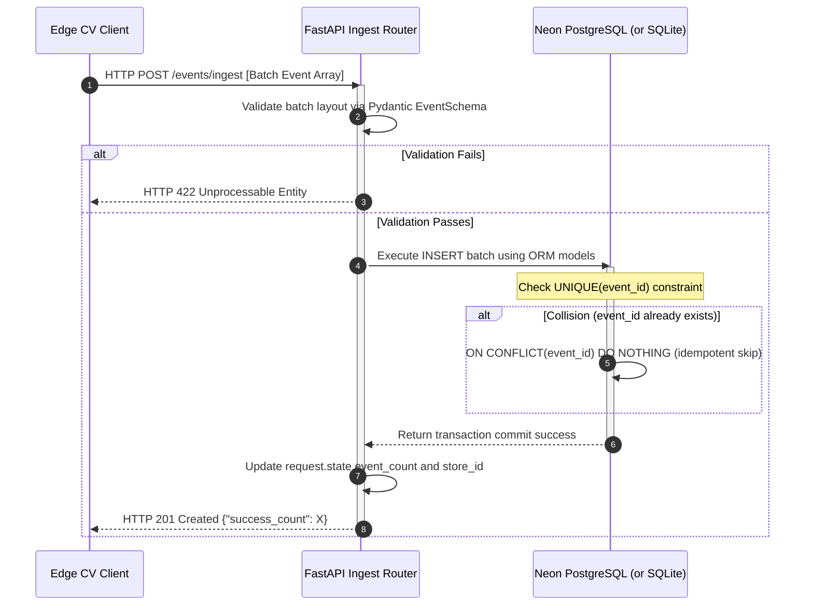

# 📊 Data Flow Specification

This document details the data schemas, step-by-step processing pipelines, and data transmission models of the **Retail Intelligence Platform**, tracking shopper telemetry from CCTV cameras to executive visualization.

---

## 1. End-to-End Shopper Data Lifecycle

```
[ CCTV Camera Feed ]
        │
        ▼ (Raw Video Frames)
[ YOLOv8 Object Detection ] ──> Filter: Class 0 (Person Only)
        │
        ▼ (Bounding Boxes [x1, y1, x2, y2])
[ Centroid Projection ] ──> Anchor: cx = (x1+x2)/2, cy = y2 (feet location)
        │
        ▼ (Centroid Coordinates)
[ Ray-Casting solver ] ──> Point-in-Polygon intersection vs. store_layout.json
        │
        ▼ (Zone transition triggers: ENTRY, ZONE_ENTER, DWELL, EXIT)
[ Schema Validation ] ──> Pydantic verification and local log writing (events.jsonl)
        │
        ▼ (POST /events/ingest batch payload)
[ API Ingestion Router ] ──> Idempotency validation (ON CONFLICT DO NOTHING)
        │
        ▼ (Flattened event fields write)
[ Neon PostgreSQL Database ]
        │
        ▼ (Real-time SQL aggregations: Funnels, Heatmaps, Rules Engines)
[ Streamlit Dashboard ] ──> Renders executive KPI metrics & operations feeds
```

---

## 2. Subsystem Data Flows

### A. Event Ingestion Flow (`POST /events/ingest`)
The ingestion pipeline is designed for high-concurrency batch writes with database-level idempotency protection.



---

## 3. Data Processing & Coordinate Math Heuristics

To map raw CCTV pixels to accurate physical shopper movements, the pipeline implements three core mathematical operations:

### 1. Bounding Box to Centroid Mapping
Standard bounding box outputs from object detection contain corner pixels `[x1, y1, x2, y2]`. The edge pipeline ([`detect.py`](file:///c:/Deepyaman%20Mondal/retail-intelligence-platform/pipeline/detect.py)) projects this box to a single centroid $(cx, cy)$ using the formulas:

$$cx = \frac{x_1 + x_2}{2}$$
$$cy = y_2$$

* **Why $cy = y_2$?:** In security camera setups, the bottom line of the box corresponds to the shopper's feet on the floor. This eliminates tracking skew caused by height differences or shopper postures.

### 2. Point-in-Polygon Ray Casting
The tracking coordinate $(cx, cy)$ is validated against zone polygons defined in `data/store_layout.json` (such as `APPAREL`, `COSMETICS`, or `BILLING`). The Point-in-Polygon algorithm ([`zones.py`](file:///c:/Deepyaman%20Mondal/retail-intelligence-platform/pipeline/zones.py)) casts a horizontal ray to the right of the point:

* An **odd number** of polygon line intersections indicates the point is **inside** the zone.
* An **even number** of intersections indicates the point is **outside** the zone.

```text
       Outside Zone                      Inside Zone
   ┌───────────────────┐             ┌───────────────────┐
   │                   │             │                   │
   │  (cx, cy)─────────┼───> [1 Inters.] (cx,cy)─────────┼───> [1 Inters. (ODD)]
   │                   │             │                   │
   └───────────────────┘             └───────────────────┘
```

### 3. Euclidean Distance Centroid Association
The tracking module ([`tracker.py`](file:///c:/Deepyaman%20Mondal/retail-intelligence-platform/pipeline/tracker.py)) associates centroids across consecutive frames by calculating a distance matrix. Detections are assigned to active tracks if their Euclidean shift is within a strict threshold:

$$d = \sqrt{(cx_{new} - cx_{old})^2 + (cy_{new} - cy_{old})^2} \le 180\text{ pixels}$$

Lost tracks are preserved in memory for up to 45 frames (3 seconds) to prevent identity switches when visitors are temporarily occluded by shelving.

---

## 4. Analytics Generation Flow

The analytics engine ([`metrics.py`](file:///c:/Deepyaman%20Mondal/retail-intelligence-platform/app/metrics.py)) calculates core KPIs directly from raw events:

### Conversion Rate Calculation
* **Visitor:** A unique `visitor_id` with an `ENTRY` event.
* **Buyer:** A unique `visitor_id` with a `PURCHASE_COMPLETED` event.
* **Formula:**
  $$\text{Conversion Rate} = \left( \frac{\text{Total Unique Buyers}}{\text{Total Unique Visitors}} \right) \times 100$$
* **Implementation:** Performs a single optimized SQL query using count aggregations on the `visitor_id` grouped by `event_type`.

### Dwell-Time Heatmaps
* The heatmap endpoint (`GET /{store_id}/heatmap`) compiles total time spent in each zone.
* On entry, a timer starts. On exit, a `ZONE_DWELL` event is logged with the elapsed time in milliseconds.
* The API returns normalized average dwell times to the dashboard:
  $$\text{Avg Dwell (min)} = \frac{\sum(\text{dwell\_ms})}{60,000 \times n}$$

---

## 5. Dashboard Consumption Flow

The Streamlit dashboard runs in an asynchronous loop, fetching data from the backend APIs at regular intervals:

1. **KPI Visuals:** Polls `GET /{store_id}/metrics` to display footfall, average dwell duration, and sales conversions.
2. **Funnel Charts:** Queries `GET /{store_id}/funnel` to render shopper drop-off graphs (Entrance -> Browser -> Queue -> Purchase).
3. **Zone Heatmaps:** Polls `GET /{store_id}/heatmap` to map shopper concentrations.
4. **Operations Log:** Polls `GET /{store_id}/anomalies` to check for active queue spikes or dead zones, rendering warning alerts.
